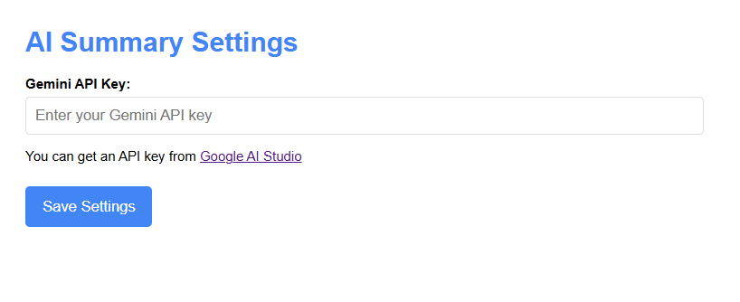
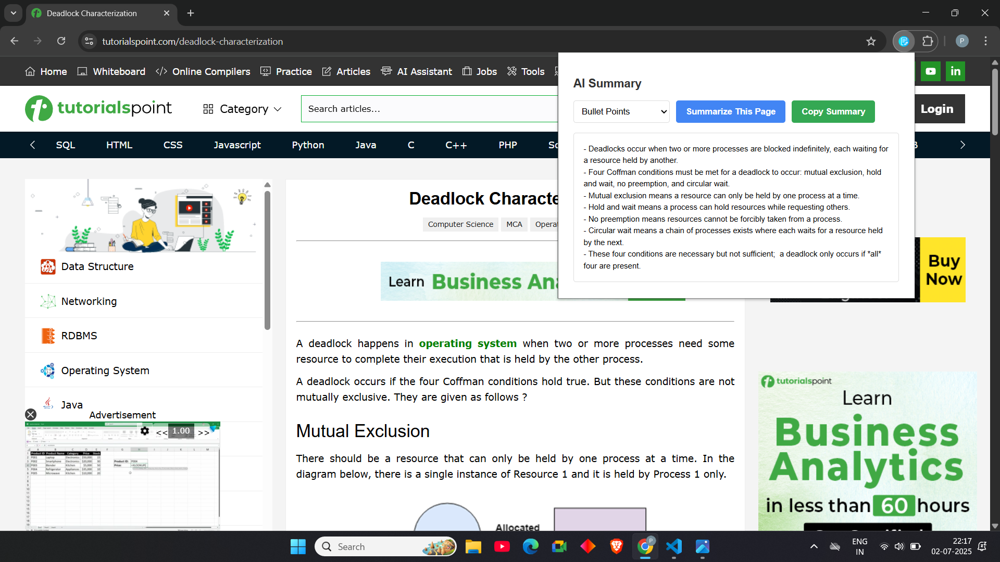
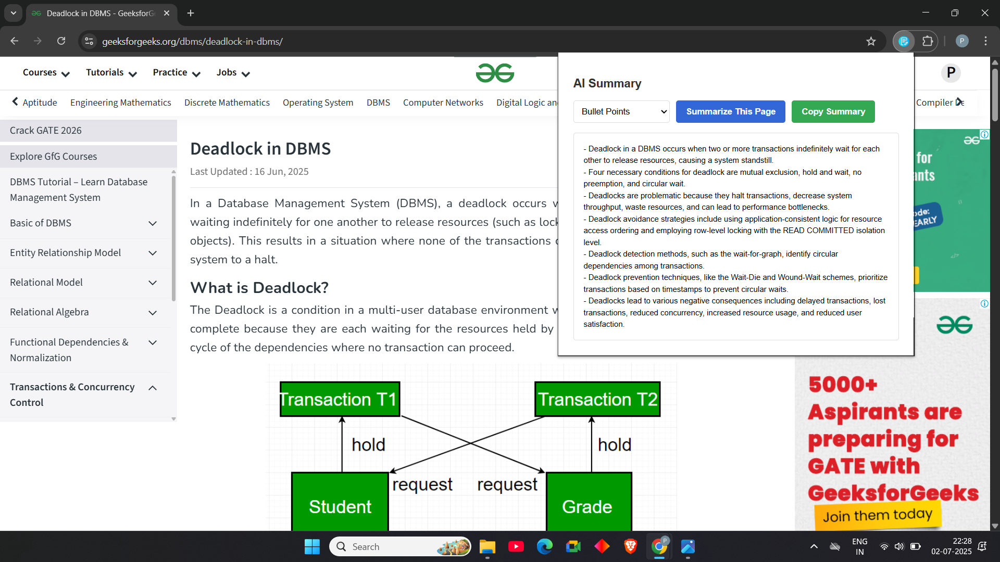

# 🔍 SummariseIT — AI-Powered Article Summarizer Chrome Extension

**SummariseIT** is a simple and powerful Chrome extension that helps you instantly summarize web articles using Google's Gemini AI. Whether it's a long blog post, news article, or documentation, SummariseIT delivers concise and readable summaries — right inside your browser.

---

## 🚀 Features

- 🧠 **AI Summarization** powered by Gemini 1.5
- 📄 **Full Page Article Extraction** — no need to highlight text
- ✨ **Three Summary Styles**:
  - **Brief** — 2–3 sentences
  - **Detailed** — full breakdown
  - **Bullet Points** — 5–7 key takeaways
- 📋 **One-Click Copy** of the summary
- 🔐 **Secure API Key Storage** using Chrome Sync
- ⚙️ Built with **Manifest V3** for fast and secure performance

---

## 📸 Screenshots

### 🔹 Popup Interface
This is the extension popup where you choose the summary type and generate the result.

### 🔹 AI-Generated Summary
Example of a clean, concise bullet-point summary generated by Gemini AI.

---

